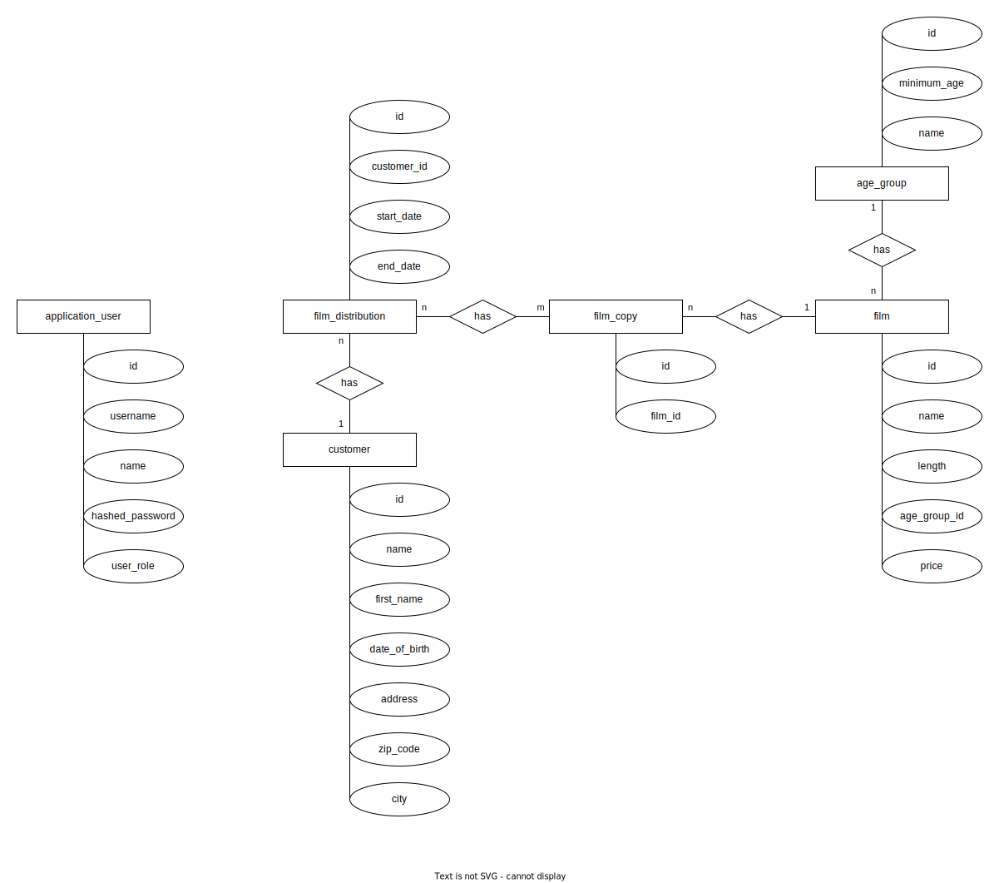

# Film Distribution

Für die Ausleihe der Filme, Rechnungen der Kunden, Kundendaten, Kontingent der Filme und eine wöchentliche Kalkulation
aller Kosten, haben wir eine Webapplikation als Softwarelösung entwickelt.

Die Software beinhaltet ein Accountsystem, mit dem es möglich ist, neue Benutzer als Admin hinzuzufügen und somit nur
bestimmten Personen Zugriff auf die Anwendung zu erlauben.

Ein Benutzer kann dabei zwei Rollen zugeordnet werden (Admin und User).

#### Admin:

* Zugriff auf alle Seiten
* Account-Verwaltung

#### User:

* Zugriff auf alle Seiten, bis auf die Accountverwaltungsseite
* Keine Account-Verwaltung

Für die Logik der Film Ausleihe, besitzt jeder Film ein bestimmtes Kontingent an Film-Kopien.
Auf dieser Basis können anschließend Ausleihen erstellt werden.

Zu einer Ausleihe gehört jeweils ein Kunde, eine beliebige Anzahl an Film-Kopien sowie
ein Start- und ein End-Datum.

Die Berechnung ergibt sich anhand der angefangenen Wochen über den Zeitraum der Ausleihe.

#### Beispiel:

> Start-Datum: 15.09.2023 (Freitag)  
> End-Datum: 05.10.2023 (Donnerstag)  
> Preis/Woche: 5 €
>
> => 3 angefangene Wochen ausgehend von Freitag  
> Preis: 15 €

Des Weiteren können Rechnungen und Berichte mit bestimmten Filtern als PDF erstellt und ausgedruckt werden.

In folgenden werden die einzelnen Unterseiten genauer beschrieben.

---
## Technologies/Frameworks

* Java 17
* Vaadin 24 (24.1.12)
* Maven (Build Tool)
* Oracle DB
* Spring Boot (3.1.0)

---
## Running the Application

1. mvn install
   * Mit `mvn install` werden alle nötigen Dependencies heruntergeladen.
2. Datenbank Verbindung konfigurieren
   * Unter `src/main/resources/application.yml` muss eine Datenbank Verbindung eingetragen werden

   ```yml
    spring:
       datasource:
          driver-class-name: oracle.jdbc.OracleDriver
          url: jdbc:oracle:thin:@//h2922093.stratoserver.net:1521/orcl.stratoserver.net
          username: video
          password: Gruppe2
    ```

3. Mit `spring-boot:run` kann die Anwendung gestartet werden.
   * Beim ersten Starten dauert es ein paar Minuten, da erst einige Pakete installiert werden.
   * Alternativ kann auch der Einstiegspunkt der Anwendung zum starten verwendet werden.
      * `src/main/java/com/bbs/filmdistribution/Application.java`

---
## Menu (Pages)

### Dashboard

Das Dashboard bietet allgemeine Informationen über die gesamte Webapplikation.
Angefangen mit der Anzahl von Filmen, Kunden, Ausleihen und Film-Kopien gibt es außerdem zwei Diagramme.

**Balkendiagramm:**  
Zeigt die Top 5 Filme, auf Basis der aktuell ausgeliehenen Film-Kopien.

**Donut-Chart:**  
Zeigt die Umsätze der aktuell ausgeliehenen Filme an.

### Distributions

Auf dieser Seite können die Film-Ausleihen verwaltet werden.
Hier können neue Ausleihen erstellt sowie bestehende Ausleihen geändert und entfernt werden.

Bei jedem Speichern wird geprüft, ob die ausgewählten Film-Kopien dem Alter des Kunden entsprechen
und ob die Film-Kopien noch verfügbar sind.

Außerdem kann zu jeder bestehenden Ausleihe eine Rechnung als PDF erstellt werden.
Die ausgeliehenen Filme und die entsprechenden Altersgruppen können ebenfalls für jeden Kunden eingesehen werden.

Für die Auswertung zu einem bestimmten Kunden, Film oder Stichtag kann ein entsprechender Bericht erstellt werden.
Die nötigen Filter können über der Tabellen Ansicht eingestellt und anschließend über "Create Report" erstellt werden.

**Filter Optionen**

* **Kunde**: Bericht über die Ausleihen eines bestimmten Kunden.
* **Film**: Bericht über die Ausleihe zu einen bestimmten Film.
* **Stichtag**: Bericht über die Kunden und Ausleihen zu einem bestimmten Stichtag.

Die Filter können auch in Kombination genutzt werden.

### Customers

Auf dieser Seite können Kunden verwaltet werden.
Es können neue Kunden erstellt und bestehende Kunden angepasst oder entfernt werden.


### Films

Diese Seite dient zur Verwaltung der Filme. Hier können Filme erstellt und bei Bedarf angepasst oder entfernt werden.
Bei jedem neuen Film kann eine Anzahl bestehender Kopien angegeben werden, damit diese anschließend automatisch erstellt
werden.

Jeder Film hat dabei einen festen Preis für jede angefangene Woche.
Außerdem hat jeder Film ein bestimmtes Mindestalter, um dieses bei der Ausleihe mit dem Alter des Kunden zu überprüfen.


### Film Copies

Zu jedem Film gibt es eine bestimmte Anzahl an Film-Kopien. Diese können auf dieser Seite verwaltet werden.
Es können zu einem bestimmten Film neue Film-Kopien erstellt werden, die von Kunden ausgeliehen werden können.


### Age Groups

Auf dieser Seite können die Altersgruppen für die Filme festgelegt werden.

### Account (Admin Only)

Diese Seite dürfen nur Benutzer mit der Admin Rolle betreten.
Hier können neue Benutzer für die Verwaltung der Webapplikation angelegt oder bestehende angepasst oder entfernt werden.

___
## SQL Scripts

Die verschiedenen, benötigten SQL-Skripte sind in strukturierten MarkDown-Dateien
hinterlegt: [Vollständige Übersicht über SQL-Skripte](doc/sql/sql.md). Es wird unterschieden zwischen
Installation-Skripten,
die bei einer Installation die benötigten Tabellen erstellen und mit initialen Daten befüllen und den Skripten, die zur
Laufzeit benötigt werden. Die Skripte zur Laufzeit sind im Programm implementiert und stellen die Schnittstelle zwischen
Anwendung und Datenbank dar.

___
## ER-Diagram



___
## Optional: Class Explanation (Database related)

Zur Übersicht werden im Folgenden einige grundlegende Klassen erklärt, die in der Anwendung häufig verwendet werden.

#### Repository

Die sogenannten `Repository`-Klassen stellen die Schnittstelle zwischen der Anwendung und der Datenbank dar. In dieser
Anwendung wird Hibernate bzw. Spring JPA verwendet, um auf die Datenbank zuzugreifen. Diese Frameworks übernehmen die
grundlegenden CRUD-Operationen (Create, Read, Update, Delete). Da für diese Operationen keine direkten SQL-Skripte
implementiert werden müssen, sind alle SQL-Befehle, die implizit verwendet werden, in der Schnittstellen-Dokumentation
aufgeführt: [Vollständige Übersicht über SQL-Skripte](doc/sql/sql.md).

Komplexere SQL-Skripte sind als `Query` in den entsprechenden Repositories implementiert. Auf diese Weise kann mit
einem `Repository` auch ein parametrisierte SQL-Befehl direkt ausgeführt werden.

#### Entities

Eine `Entity` ist im Grunde ein Datenobjekt, das eine oder mehrere Tabellen einer Datenbank abstrahiert. Für
jede `Entity` gibt es eine entsprechende `Repository`-Klasse. Das Repository kann die von der Datenbank abgerufenen
Daten in `Entity`-Objekte übertragen oder auch `Entity`-Objekte in die Datenbank speichern. Die `Entity` kann dann
überall in der Anwendung verwendet werden.

#### Service

`Services` enthalten die Business-Logik der Anwendung. Passenden zu den `Entities` und `Repositories` gibt es jeweils
einen `Service`. Dieser abstrahiert wiederum das Laden und Speichern und kann zusätzliche Methoden und Logik enthalten.
Daher werden die Services in der Anwendung verwendet, um Daten zu verwalten.

#### View

Die `Views` stellen im Prinzip die Schnittstelle zum Benutzer dar. In den einzelnen `Views` ist genau definiert, wie die
Benutzeroberflächen der Anwendung aussehen, welche Daten angezeigt werden und welche Interaktionsmöglichkeiten der
Nutzer letztendlich hat. Eine `View` verwendet wiederum einen oder mehrere `Services`, um Daten abzurufen oder auch zu
speichern.

#### Config

Die grundlegende Konfiguration der Anwendung, die bereits beim Start der Anwendung benötigt wird, wird ist in den
Ressourcen der Anwendung hinterlegt. Bei dem verwendeten Spring-Framework ist diese Konfiguration in
sogenannten `application.yaml`-Dateien abgelegt. Hier ist zum Beispiel die Datenbankverbindung oder weitere
Infrastruktur wie Mail-Server oder verwendete Ports der Web-Application konfiguriert

___
## Dependencies (artifacts)

Eine Auflistung aller wichtigen Bibliotheken die für das Projekt genutzt wurden.

#### vaadin

Framework für die Erstellung von modernen Webanwendungen, mit einer komplett Serverseitigen Architektur.
Die gesamte Anwendung kann dabei mit der Programmiersprache Java realisiert werden.

#### spring-boot-starter-security

Sicherheitsmechanismen für die Webapplikation.
Beinhaltet Authentifizierung, Passwort-Hash Funktionen und Session-Management.

#### ojdbc8

Treiber für die Oracle Datenbank.

#### lombok

Vereinfacht die Erstellung von sogenannten Boilerplate Code durch Annotationen.
Als Beispiel können klassische get und set Methoden einfach weggelassen werden.
Diese können durch Annotationen über der Klasse oder des Feldes ersetzt werden (@Getter, @Setter).

#### apexcharts

Erstellung von Charts und Diagrammen mithilfe des Builder-Patterns.

#### jsoup & flying-saucer-pdf-openpdf

Erstellung von PDF Dateien auf Basis von HTML und CSS.